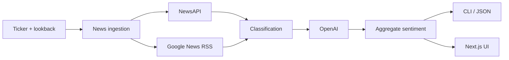

# Stock Sentiment Analysis

Ingest recent equity news, classify article sentiment with an LLM, and return a concise market readout. Ships as a Python CLI, a Next.js web app, and deployable surfaces for Vercel and Fly.io.

## Pipeline



## Surfaces

| Surface | Entry | Best for |
| --- | --- | --- |
| CLI | `python3 -m stock_sentiment analyze TSLA` | Scripting and automation |
| Next.js | `npm run dev` → `localhost:3000` | Production web UI on Vercel |
| Python UI | `python3 -m stock_sentiment ui` | Local WSGI preview |

## Quick start

```bash
export OPENAI_API_KEY=...

python3 -m pip install -e .
python3 -m stock_sentiment analyze TSLA
```

Optional NewsAPI key (preferred when set):

```bash
export NEWSAPI_KEY=...
python3 -m stock_sentiment analyze TSLA --source auto
```

## Web app

```bash
npm install
export OPENAI_API_KEY=...
npm run dev
```

The analyze route lives at `app/api/analyze/route.ts`. The Next.js app is self-contained for Vercel deployment.

## Configuration

Environment variables (shell or `./.env`):

```bash
OPENAI_API_KEY=...
NEWSAPI_KEY=...              # optional
OPENAI_MODEL=gpt-5-nano-2025-08-07
OPENAI_BASE_URL=https://api.openai.com/v1
OLLAMA_BASE_URL=...          # optional alternate provider
OLLAMA_MODEL=...
```

Use `--env-file FILE` to load from a different path.

## Output modes

Text summary (default):

```bash
python3 -m stock_sentiment analyze TSLA
```

Structured JSON with article reasons:

```bash
python3 -m stock_sentiment analyze TSLA \
  --days 7 \
  --max-articles 50 \
  --format json \
  --include-reasons
```

JSON includes `source`, `lookback_days`, `classification_degraded`, and related metadata for downstream systems. Partial LLM failures surface as degraded runs instead of silent neutral scores.

## Deployment

**Vercel** — set `OPENAI_API_KEY` (and optionally `NEWSAPI_KEY`) in project env vars. No `vercel.json` required.

**Fly.io** — `Dockerfile` serves the Python UI on port 8080:

```bash
fly launch --generate-name --internal-port 8080 --no-deploy
fly secrets set OPENAI_API_KEY=...
fly deploy
```

## Testing

```bash
python3 -m unittest discover -s tests -p "test_*.py"
npm install
npx playwright install --with-deps chromium
npx playwright test tests/test_ui_browser.spec.js --reporter=line
```

## Disclaimer

Informational use only. Not financial advice.

## License

MIT. See [LICENSE](LICENSE).
