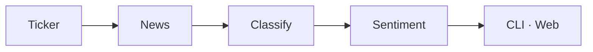

# Stock Sentiment Analysis

Recent equity news distilled into an evidence-backed near-term decision brief. Every result shows coverage, agreement, and the headlines driving the conclusion.



## Get started

```bash
export OPENAI_API_KEY=...

python3 -m pip install -e .
python3 -m stock_sentiment analyze TSLA
```

Web app:

```bash
npm install && npm run dev   # http://localhost:3000
```

## Overview

| Surface | Entry |
| :-- | :-- |
| CLI | `python3 -m stock_sentiment analyze TSLA` |
| Next.js | `npm run dev` |
| Python UI | `python3 -m stock_sentiment ui` |

News sources: NewsAPI when `NEWSAPI_KEY` is set, otherwise Google News RSS. Partial classification failures are reported as degraded runs — not silent neutral scores.

`buy`, `sell`, and `hold` remain stable machine-readable values in JSON. The UI renders them as `Bullish`, `Bearish`, and `No edge`. Limited evidence always returns `hold`. The decision brief is derived from the article classifications, so it makes no extra AI call.

JSON output:

```bash
python3 -m stock_sentiment analyze TSLA --format json --include-reasons
```

## Reference

| Variable | Role |
| :-- | :-- |
| `OPENAI_API_KEY` | Required for classification (CLI; or `OLLAMA_API_KEY`) |
| `OLLAMA_API_KEY` | Web app / Ollama Cloud. Bare `AI_MODEL` ids run here |
| `AI_MODEL` | Web app model. Default: `gpt-oss:120b` (free Ollama Cloud) |
| `NEWSAPI_KEY` | Optional; preferred in `--source auto` |
| `OPENAI_MODEL` | CLI override model (see repo defaults) |

**Test.**

```bash
python3 -m unittest discover -s tests -p "test_*.py"
```

Informational use only. Not financial advice.

MIT · [LICENSE](LICENSE)
