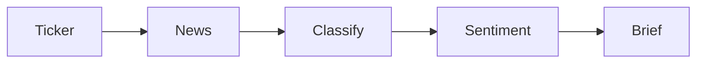

# Stock Sentiment Analysis

Equity news, classified article by article, distilled into a near-term decision brief you can audit. Every conclusion shows its coverage, agreement rate, and the headlines behind it.


```mermaid
flowchart LR
  T[Ticker] --> N[News]
  N --> C[Classify]
  C --> S[Sentiment]
  S --> O[Brief]
```

## How it works

1. **Ingest.** NewsAPI when `NEWSAPI_KEY` is set, otherwise Google News RSS.
2. **Classify.** One bounded model turn per article batch. Each article gets `buy`, `sell`, or `hold`.
3. **Brief.** The decision brief is derived from the article classifications. No extra AI call, no second opinion layered on top.

Classification failures are reported as degraded runs, not silent neutral scores. Limited evidence always returns `hold`. The machine-readable values stay stable in JSON; the UI renders them as Bullish, Bearish, and No edge.

## Quickstart

```bash
export OPENAI_API_KEY=<redacted>

python3 -m pip install -e .
python3 -m stock_sentiment analyze TSLA
```

JSON output with reasons:

```bash
python3 -m stock_sentiment analyze TSLA --format json --include-reasons
```

Web app:

```bash
export AI_GATEWAY_API_KEY=<redacted>
# Optional Ollama route: AI_MODEL=gpt-oss:120b and OLLAMA_API_KEY
npm ci
npm run dev                  # http://localhost:3000
```

## Architecture

| Surface | Entry |
| :-- | :-- |
| CLI | `python3 -m stock_sentiment analyze TSLA` |
| Next.js web | `npm run dev` |
| Python UI | `python3 -m stock_sentiment ui` |

The web classifier uses the OpenAI Agents SDK. Ollama runs Chat Completions with reasoning disabled; the AI Gateway keeps its Responses API JSON schema. Every retry and provider fallback shares a 45-second classification deadline. Incomplete model output is rejected. News retrieval has its own timeout.

Model routing is explicit:

| Variable | Role |
| :-- | :-- |
| `OPENAI_API_KEY` | Classification via CLI (or `OLLAMA_API_KEY`) |
| `OLLAMA_API_KEY` | Web app / Ollama Cloud. Bare `AI_MODEL` ids run here |
| `AI_MODEL` | Web app model. Default: `openai/gpt-5.6-luna` (Vercel AI Gateway) |
| `AI_GATEWAY_API_KEY` / `VERCEL_OIDC_TOKEN` | Auth for web `provider/model` ids |
| `AI_FALLBACK_MODEL` | Optional fallback model, same routing rules |
| `OLLAMA_BASE_URL` / `AI_GATEWAY_BASE_URL` | Optional endpoint overrides |
| `NEWSAPI_KEY` | Optional; preferred in `--source auto` |
| `OPENAI_MODEL` | CLI override model (see repo defaults) |

## Test

```bash
python3 -m unittest discover -s tests -p "test_*.py"
npm test
npm run typecheck
npm run build
```

Tests use fixtures and mocked HTTP responses. They make no live AI calls and do not establish model quality or trading performance.

Informational use only. Not financial advice.

MIT · [LICENSE](LICENSE)
